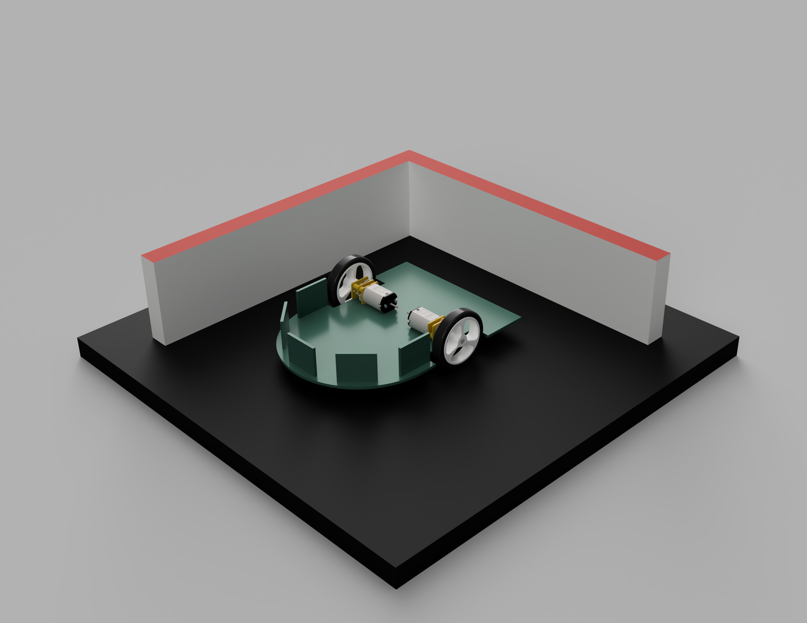
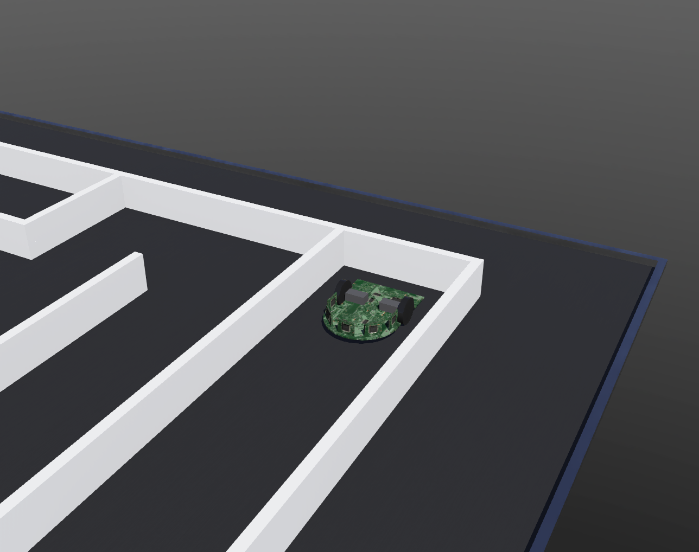
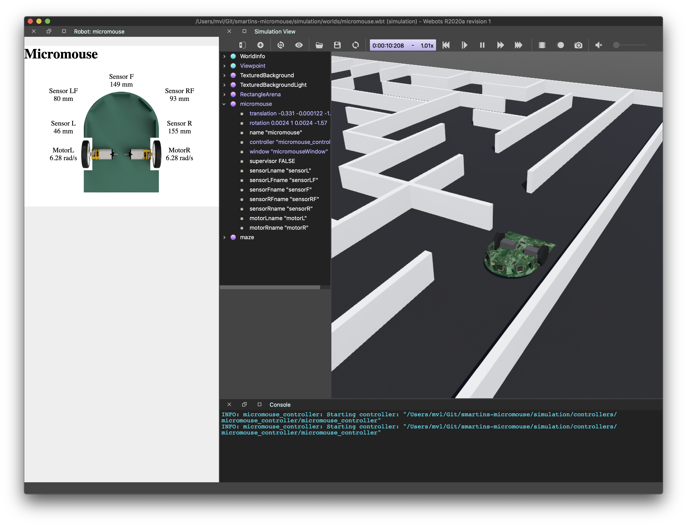
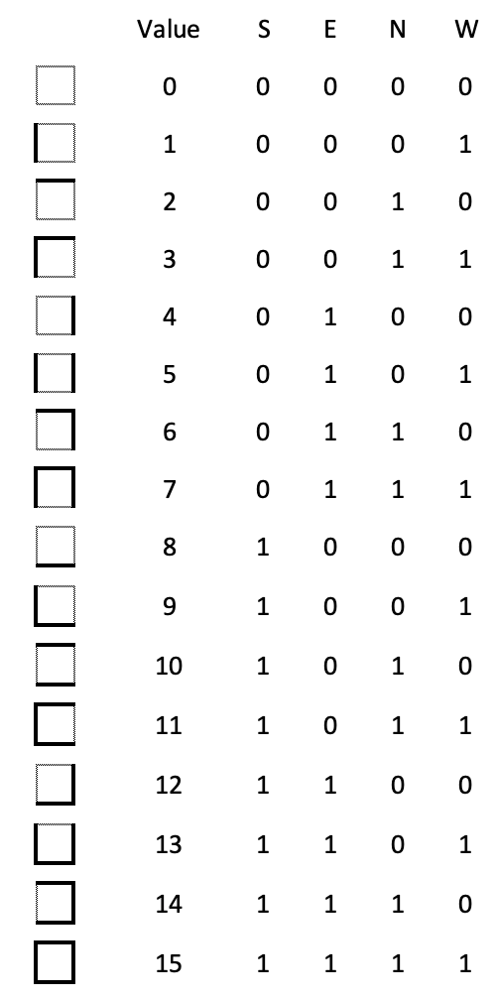

# Micromouse
A Micromouse project

## Introduction


### Folder structure
```
+-- docs
+-- simulation
|   +-- controllers     => C robot controler
|   +-- generateMaze    => maze generater script
|   +-- plugins         => robot window
|   +-- protos          => subparts for simulation
|   +-- worlds          => main simulation files
+-- README.md
```

### Fusion 360 render


### Simulation in Webots


## Simulation
To simulate the [Webots package](https://github.com/cyberbotics/webots) is used. The documentation can be found [here](https://cyberbotics.com/doc/guide/index).



To run the simulation execute the following:
* Download and install Webots, see [installation guide](https://cyberbotics.com/doc/guide/installing-webots)
* Clone or download [this](https://github.com/martin-vl/smartins-micromouse) repository
* Open the simulation file /simulation/worlds/micromouse.wbt
* Run simulation with the play button

### Generate maze
With a python script a new maze can be generated, which results in a new maze.proto file.
```
# cd /simulation/generateMaze/
# python genMaze.py
```
Within the python file the maze can be changed by editing the maze array (mzArray). In the image below the representation of the numbers can be found.



